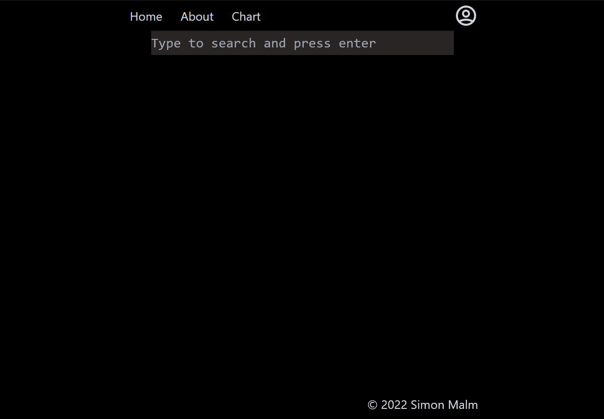
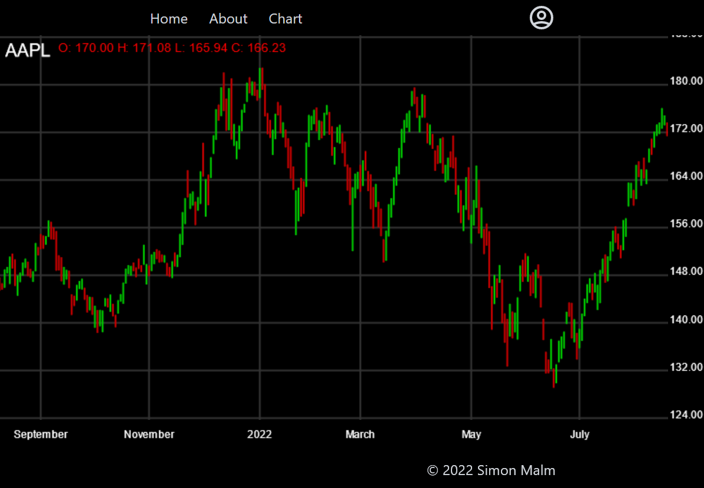

## Introduction

This is a [nextjs](https://nextjs.org/) project, styled with [tailwind css](https://tailwindcss.com/)

The purpose of this repo is to learn react, javascript and working with api as a first project. To this effect, this website uses financial information gathered by a [backend flask server](https://github.com/a19simma/StockServer) and to meaningfully display it using html5 canvas.

The relevant code in this project is the CandleStickChart.js component and the CandleStickChart.js in the lib folder as this is where the logic and rendering code resides.





To run it locally you can clone the project and run the development server:

```
npm i
npm run dev
```

